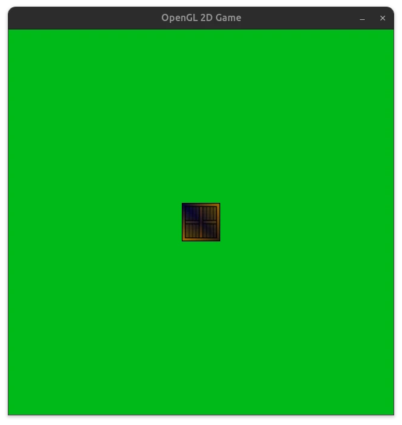

# OpenGL 2D Game
OpenGL 2D game written in C++



## Dependencies

### Install GLFW dependencies
```
sudo apt install libglfw3 libglfw3-dev 
```

### Install GLEW dependencies
```
sudo apt install libglew-dev
```

### Install SDL_mixer dependencies
```
sudo apt install libsdl2-dev libsdl2-mixer-dev
```

## Setup Build Directory
* Setup a build directory to compile and run the program
* Setup a compile database to lint the project

```
cmake -DCMAKE_EXPORT_COMPILE_COMMANDS=ON . -B build
```

## Test OpenGL Works
Write simple OpenGL code to draw a triangle to test that OpenGL works.
```
/* Render here */
glClear(GL_COLOR_BUFFER_BIT);

// Draw triangle to test OpenGL works
glBegin(GL_TRIANGLES);
glVertex2f(-0.5f, -0.5f);
glVertex2f(0.0f, 0.5f);
glVertex2f(0.5f, -0.5f);
glEnd();

/* Swap front and back buffers */
glfwSwapBuffers(window);
```

## C++ Linter
### Installation
Install clang-tidy
```
sudo apt install clang-tidy
```

## stb_image.h by Sean Barrett
I included the [stb_image.h](https://github.com/nothings/stb/blob/master/stb_image.h) header file to load a texture image file for the object.
Thanks to [Sean Barrett](https://github.com/nothings) for allowing me to use this header file for this project.

The stb_image.h header file comes from the [stb](https://github.com/nothings/stb/tree/master) repo.

## Useful Resources
- [LearnOpenGL](https://learnopengl.com/)
  - [Hello Triangle](https://learnopengl.com/Getting-started/Hello-Triangle)
  - [Textures](https://learnopengl.com/Getting-started/Textures)
  - [Transformations](https://learnopengl.com/Getting-started/Transformations)
  - [2D Game - Setting up](https://learnopengl.com/In-Practice/2D-Game/Setting-up)
- [clang-tidy documentation](https://clang.llvm.org/extra/clang-tidy/)
